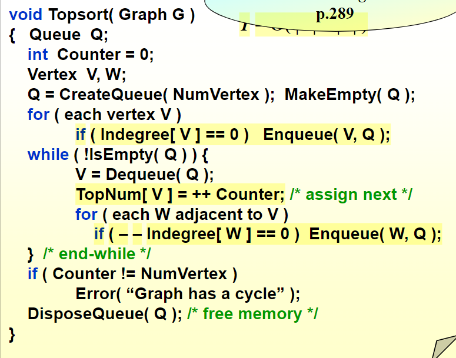
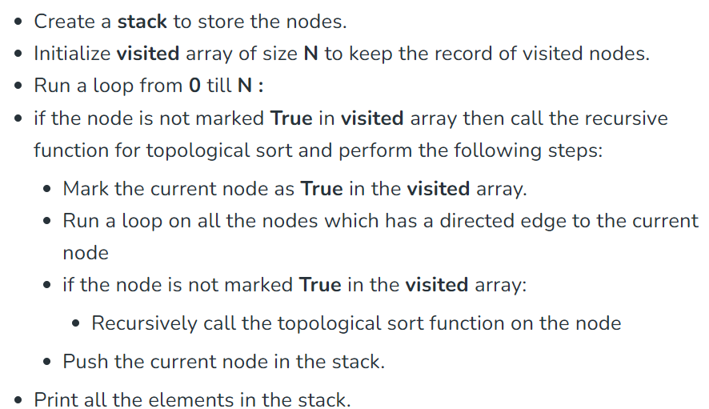

# 拓扑排序
## 问题描述
---
Topological sorting for Directed Acyclic Graph (DAG) is a linear ordering of vertices such that for every directed edge u-v, vertex u comes before v in the ordering.

## ZJK老师提供的算法
---
关键的特征：**入度**

在当前情况下，对于任何入度为0的节点，都可以直接被压入我们的拓扑排序所构建的队列。

我们还要明确有向无环图的性质：

- 对于任意一个有向无环图，都存在至少一个节点，它的入度为0（解决本问题的关键性质，性质的证明可以用反证法）


## 另一种算法
---
### 总体思路


### 实现代码
```c++
// A C++ program to print topological
// sorting of a DAG
#include <bits/stdc++.h>
using namespace std;

// Class to represent a graph
class Graph {
	// No. of vertices'
	int V;

	// Pointer to an array containing adjacency listsList
	list<int>* adj;

	// A function used by topologicalSort
	void topologicalSortUtil(int v, bool visited[],
							stack<int>& Stack);

public:
	// Constructor
	Graph(int V);

	// function to add an edge to graph
	void addEdge(int v, int w);

	// prints a Topological Sort of
	// the complete graph
	void topologicalSort();
};

Graph::Graph(int V)
{
	this->V = V;
	adj = new list<int>[V];
}

void Graph::addEdge(int v, int w)
{
	// Add w to v’s list.
	adj[v].push_back(w);
}

// A recursive function used by topologicalSort
void Graph::topologicalSortUtil(int v, bool visited[],
								stack<int>& Stack)
{
	// Mark the current node as visited.
	visited[v] = true;

	// Recur for all the vertices
	// adjacent to this vertex
	list<int>::iterator i;
	for (i = adj[v].begin(); i != adj[v].end(); ++i)
		if (!visited[*i])
			topologicalSortUtil(*i, visited, Stack);

	// Push current vertex to stack
	// which stores result
	Stack.push(v);
}

// The function to do Topological Sort.
// It uses recursive topologicalSortUtil()
void Graph::topologicalSort()
{
	stack<int> Stack;

	// Mark all the vertices as not visited
	bool* visited = new bool[V];
	for (int i = 0; i < V; i++)
		visited[i] = false;

	// Call the recursive helper function
	// to store Topological
	// Sort starting from all
	// vertices one by one
	for (int i = 0; i < V; i++)
		if (visited[i] == false)
			topologicalSortUtil(i, visited, Stack);

	// Print contents of stack
	while (Stack.empty() == false) {
		cout << Stack.top() << " ";
		Stack.pop();
	}

	delete[] visited;
}

// Driver Code
int main()
{
	// Create a graph given in the above diagram
	Graph g(6);
	g.addEdge(5, 2);
	g.addEdge(5, 0);
	g.addEdge(4, 0);
	g.addEdge(4, 1);
	g.addEdge(2, 3);
	g.addEdge(3, 1);

	cout << "Following is a Topological Sort of the given "
			"graph \n";

	// Function Call
	g.topologicalSort();

	return 0;
}
```

## 另一种算法的思路分析和正确性验证
---
对于两个节点，我们定义三种关系：（因为是有向无环图，所以不存在两个节点同时具备两个特征）
- A前B后
- A后B前
- 两者无关联

**为什么我们从visit数组依次进行操作就行了？**
- 比方说，对于节点0，进行上述算法的操作，最终产生了一个具备一定节点数量的栈，这个栈中的所有节点满足：所有在这个节点之后的节点都比这个节点先压入了栈
- 接下来，从剩下的尚未被压入栈的节点中任取一个节点，那么这个节点和被压入栈的所有的节点的关系为：要么在这个节点之前，要么两者无关联（这一点说明两者的压栈顺序是任意的），所以一定可以执行压栈的操作

**很巧妙的思路，有利于我们设计算法和理解递归的作用**

上课所学的算法，则采用了另一个思路，当然同样也是维护了**一个栈**，更关键的是维护了一个**数组，记录各个节点的入度**

我们采用topNum数组来记录各个节点对应的topsort的顺序，比方说，对于节点0 top[0] = 2, 节点3 top[3] = 2, 说明两者在top排序中是“相当的“，由此产生了多样的top的节点顺序

再回到我们上课谈到的算法，我们压栈的关键衡量信息是：如果入度为0，那么就把他压入栈，否则；然后再出栈，对于每个出栈的节点，标记其为visit为true，并且除去这个节点，同时减少相邻节点的入度（**由此产生了新的indegree为0的节点**），再进行上述循环，直至栈最终为空


