# 统计量与抽样分布

## 前言
---
从这一章开始，我们将进入数理统计。

> 数理统计是一门以数据为基础的学科，它是收集数据、分析数据和由数据得出结论的一组概念、原则和方法。

### 数理统计的主要任务
从总体中抽取一部分个体，根据这部分个体的数据对总体分布或其中的未知参数给出推断。

### 应用
和实验数据处理相关的，我们都可以联系起数理统计的知识加以解决。

过往做实验的时候，我们选择了几组实验数据，来验证某个实验规律、或者验证某个电路的功能实现，其背后的机理可以归结为数理统计。

在做实验的时候，概统为我们提供了良好的分析和统计的思路。

## 随机样本与统计量
---
### 基础概念
总体：研究对象的全体

个体：总体中的每个成员

总体容量：总体中所包含的个体的数量

有限和无限总体：总体容量分别为有限和无限的总体

分布：一个变量可以有着许多的取值情况，而分布则是研究该变量取到某个特定的值（离散型）、或者该变量的取值落在某一范围（连续型）的概率的总体情况

样本：被抽取的**部分个体**被称为总体的一个样本

样本容量：样本中被抽取个体的数量

随机样本：从总体X中随机抽取n个个体，**由于这n个个体的不同，指标X的取值也不同**，分别记为$X_1, X_2, ..., X_n$

假设独立抽取，并且假设每个个体均有相同的被抽中的概率，则称随机样本$X_1, X_2, ..., X_n$为**简单随机样本**

### 两种经典的数组搜集方法
1. 抽样调查：从总体出抽出某些个体进行调查
2. 试验搜集数据：往往保有某个目的，依照达成该目的的条件和目的的效果进行合理地试验设计

> 我们对于总体的研究，往往会仅局限于研究对象的一个或几个数量指标。

> 总体的某个指标X，对于不同的个体来说有不同的取值，这些取值构成一个分布，因此X可以看成一个随机变量。

注意到我们列出的样本$X_1, X_2, ..., X_n$的值并不确定，为此，我们对样本进行观测，得出一组实数$x_1, x_2, ..., x_n$，我们称它们为样本的一个**样本值（观测值）**

### 简单随机样本的定义
- 独立性：$X_1,X_2,...,X_n$是相互独立的随机变量
- 代表性：每一个$X_i$与总体X有相同的分布函数

> 样本是进行**统计推断的依据**。在获得样本后，就要根据样本进行统计分析并对总体进行统计推断。
> 统计量是对**样本数据的加工和整理**，从而提取出的有用信息，我们可以依靠这些信息对总体做出推断。

### 统计量的定义
设$X_1,X_2,...,X_n$是来自总体X的一个样本，$g(X_1,X_2,...,X_n)$是样本的一个函数，若g不含未知参数，则称$g(X_1,X_2,...,X_n)$是一统计量

### 常见的统计量
> 只是常见的，当然统计的方法多多，包括我们计算大物实验中的不确定度什么的，这里留白
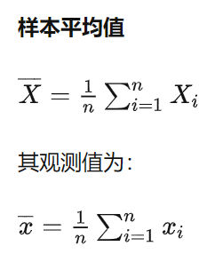
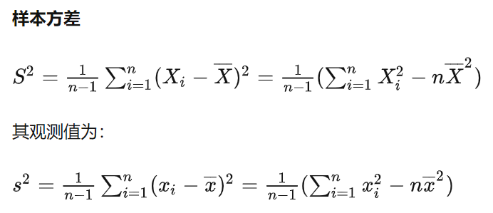
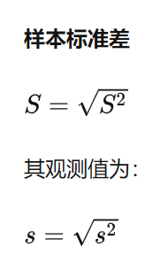
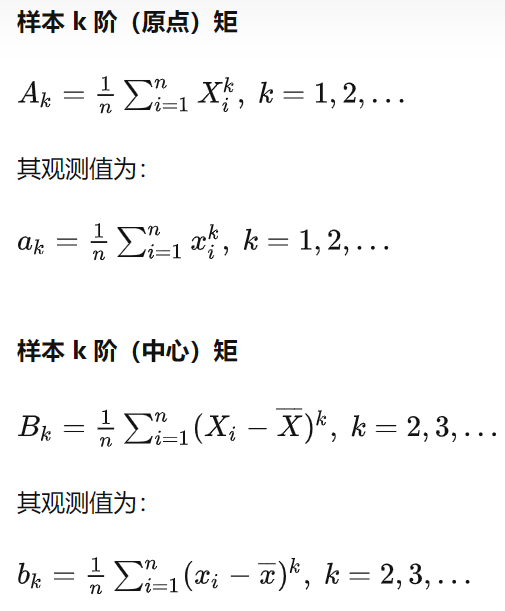

#### 对常见统计量的解释
- 它们都是一种**估计**，样本均值作总体均值的估计，样本方差作总体方差的估计

#### 样本均值为什么除以的是n
因为各个样本相互独立且有相同的被抽中的概率，按照离散型的数学期望的计算公式即可推出这一结论

方差也是同理，不过更细节的地方在于：方差除以的是$\frac{1}{n-1}$

## $\chi^2$分布，t分布和F分布
---
> 因为样本可以看成一个随机变量，那么统计量也是一个随机变量。所以研究统计量的分布就是抽样分布。

### 为什么在总体服从正态分布的情形下研究
非常神奇，在这一条件下，我们可以给出某些统计量的精确分布。

让我想起了，进行图像信息处理的时候，双边滤波的加权参数也采用的是正态分布。虽然并不理解是为什么

### $\chi^2$分布

#### 定义
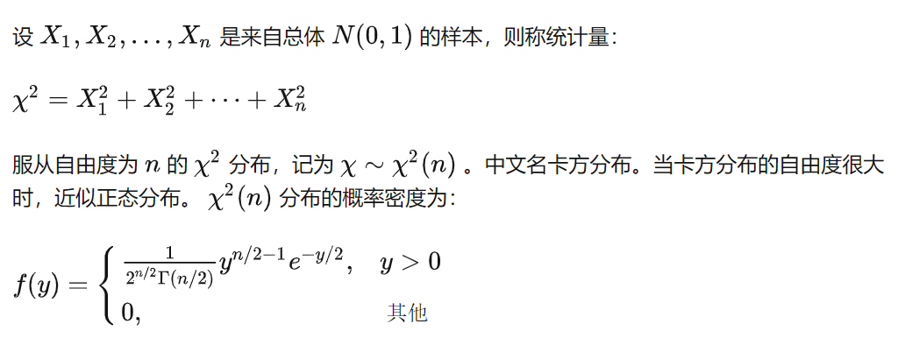

其中，自由度n决定了其密度函数的形状，如图所示：
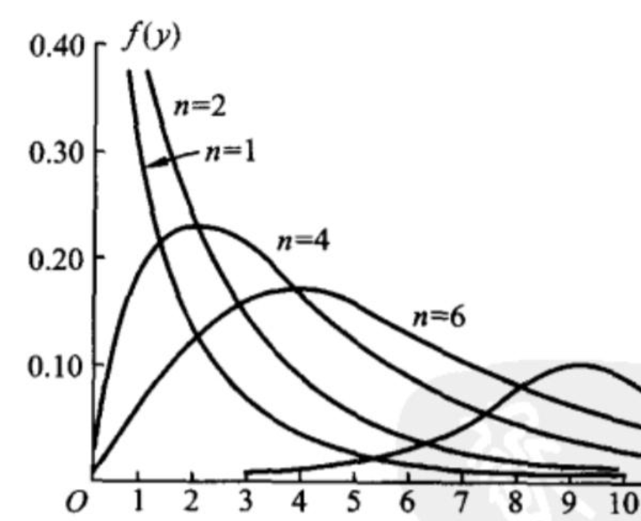

#### 性质
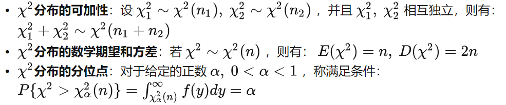

PS：
- $\chi^2$分布的分位数需要查表获得

#### 补充（Fisher公式）
当n充分大时，$\chi^2$分布上的α分位数可以有如下的近似

$$\chi^2_\alpha(n) \approx \frac{1}{2}(Z_\alpha + \sqrt{2n-1})^2$$

其中，$Z_\alpha$是标准正态分布的上α分位数

n在大于40的时候近似效果较好

### t分布
#### 定义
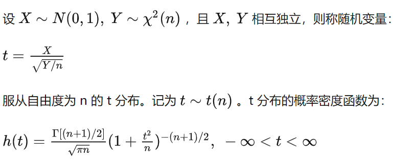

图像示例：
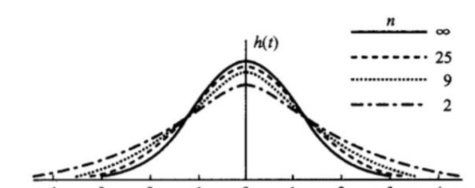

#### 性质
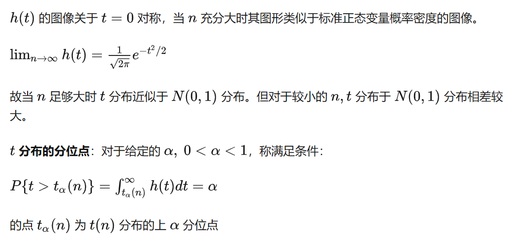
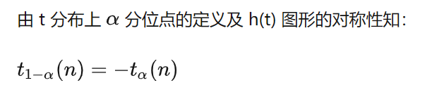

### F分布
#### 定义
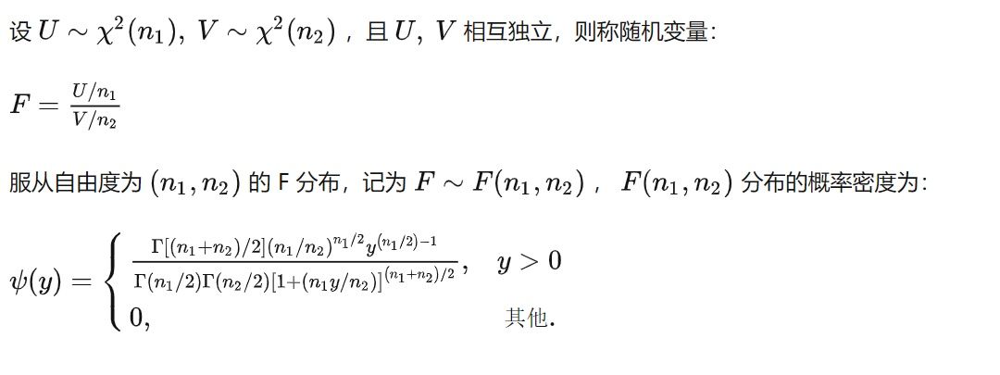

图像示例：
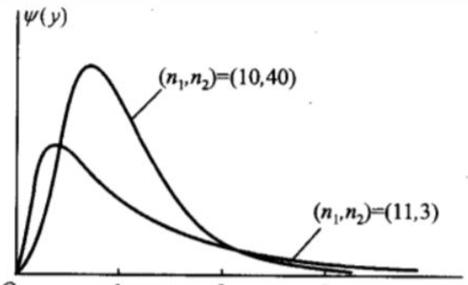

参考$\chi^2$分布所表现出的性质，n变大时密度图像整体变“扁平”，我们也可以初步得出F的概率密度函数的结论：n1变大，n2变小时，图像整体变“扁平”

#### 性质
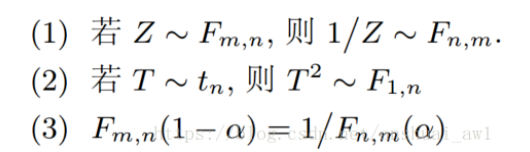

## 正态总体下的抽样分布
---
了解几个定理，记住它们即可。

- 首先是对任意一个总体（随机变量）的基本结论，也就是样本均值和样本方差与总体均值和总体方差的关系
- 然后假设了总体服从正态分布
- 定理一表明样本均值的分布性质
- 定理二表明样本方差的分布性质，并且均值和方差相互独立
- 定理三表明样本均值和方差的代数性质
- 定理四，对两个正态总体进行比较，例如比较期望、比较方差什么的 
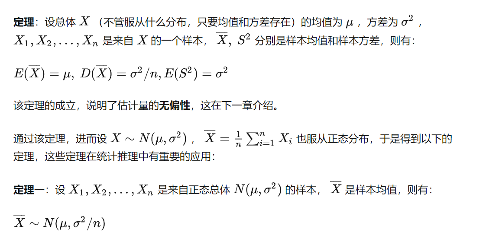
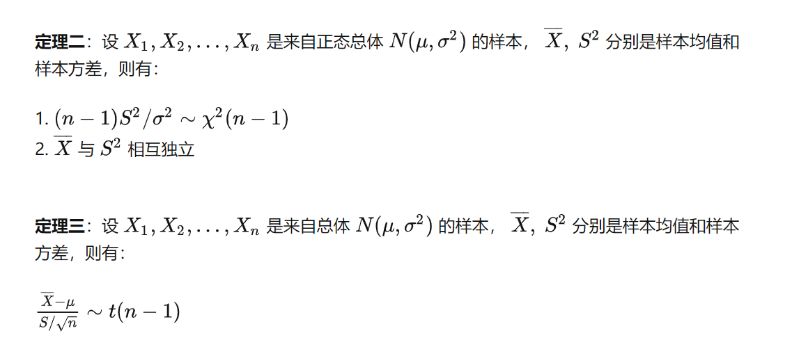
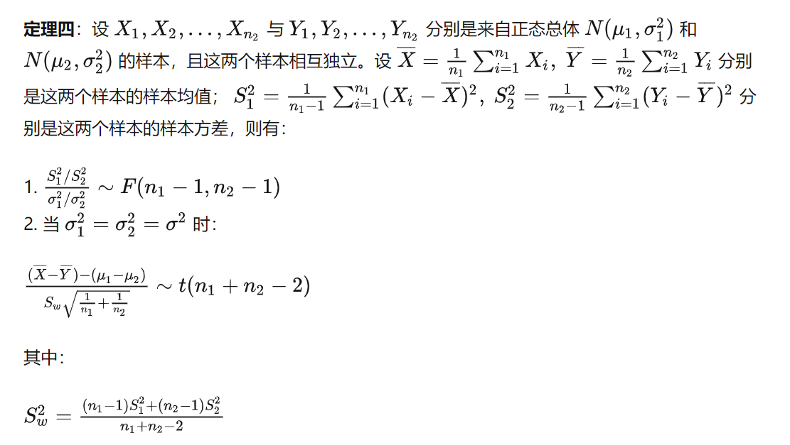

## Reference
https://zhuanlan.zhihu.com/p/344453321【截图来源，第二信息参考源】
https://blog.csdn.net/anshuai_aw1/article/details/82735201【借用了里面的一张图片】

