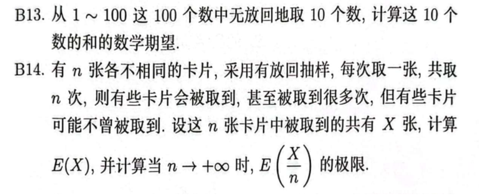
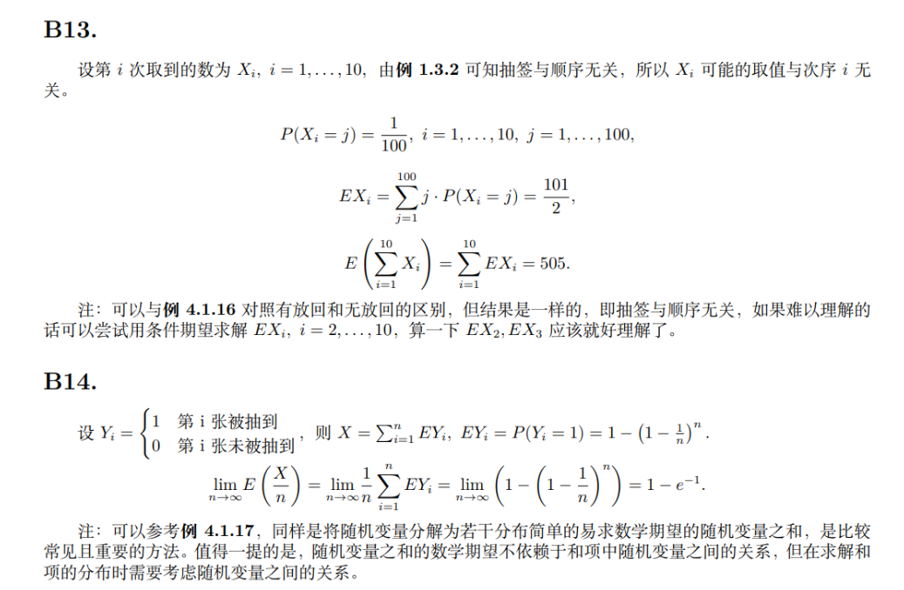
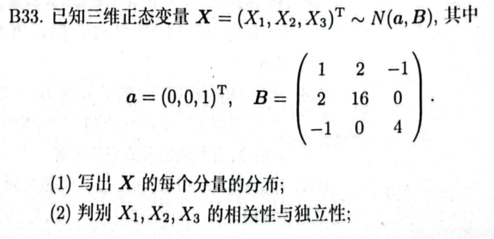

# 随机变量的数字特征习题
## 做题记录
---
本章结论性的知识偏多，并没有比较难理解的地方。

方差和协方差最终都会落到数学期望的计算当中

协方差转换为期望的公式别记错了！

## 一些题目
---
**题干**

**解答**

**题干**

**分析**

a对应的分量分别是随机变量X的期望，B则是随机变量Xi，Xj的协方差矩阵，记忆一下即可

## Reference
---
