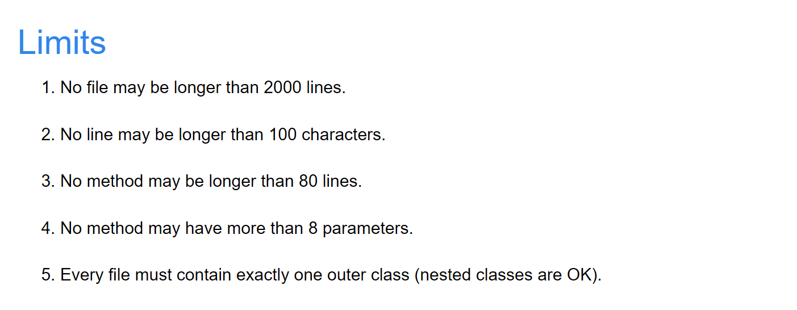

# malloc与内存溢出

## C语言内存分配情况
1. 程序区：用于存储程序的代码，也就是程序的二进制码
2. 静态存储区：用于存储全局变量和静态变量，这些变量的空间在程序编译时就已经分配好了
3. 动态存储区：用于在程序执行时分配的内存，分为堆区(heap)和栈区(stack)。

> 堆区

> 用于动态内存分配，程序运行时由内存分配函数在堆上分配内存

> 栈区

> 在函数执行时，函数内部的局部变量和函数参数的存储单元的内存区域
函数运行结束时，这些内存区域会自动释放

## 堆区的特点
堆区的最大存储量，按照网上的说法，**受限于计算机系统中有效的虚拟内存**。

比方说，32位系统下，堆内存可以达到2.9G的大小（几乎占满3G的用户空间）

堆是由C/C++函数库提供的，为了分配一块内存，库函数会按照一定的算法，在堆内存中搜索可用的足够大小的空间。

对于堆来讲，频繁的malloc/free势必会造成内存空间的不连续，从而造成大量的碎片，使程序效率降低。对于栈就不会存在这个问题。

## 栈区的特点
栈是机器系统提供的数据结构，计算机会在底层对栈提供支持：分配专门的寄存器存放栈的地址，压栈出栈都有专门的指令执行，这就决定了栈的效率比较高。

但栈区容量较小，一般在MB的数量级。有些编译器也可以主动设置，来获得更多的栈区容量。

## 我遇到的问题

在进行图像信息处理的时候，我采用了malloc，来获得存储图像信息数据的指针的内存空间。malloc的空间差不多在$2000 \times 2000 \times 4$ Byte的大小，进行2次的malloc后程序就会运行出错。

更具体的情况是：在debug时，仍然能够正确生成最终的图像；但在生成exe文件，进行run后，却会因为堆区的内存被过分占用而导致程序崩溃。

个人认为的原因是：**在debug时，程序并未被编译器和链接器进行优化，对申请的内存并未做出限制；然而在生成exe文件并run之时，就会因为程序在申请内存时候的不达标而造成程序无法运行。**

一些总结

- 以我当前的知识，无法运用好C语言在malloc对较大数据集的处理，老老实实定义静态的大数组来处理数据吧！
- 在寻找这个错误的时候，定位的时候画了一定的时间，但是如果保持模块化的代码思路，对不同模块进行查证的话，效率会提高不少。**模块化的写代码的思路和能力要坚持锻炼！**

## Reference
[代码风格指南-CS61B](https://sp21.datastructur.es/materials/guides/style-guide.html)