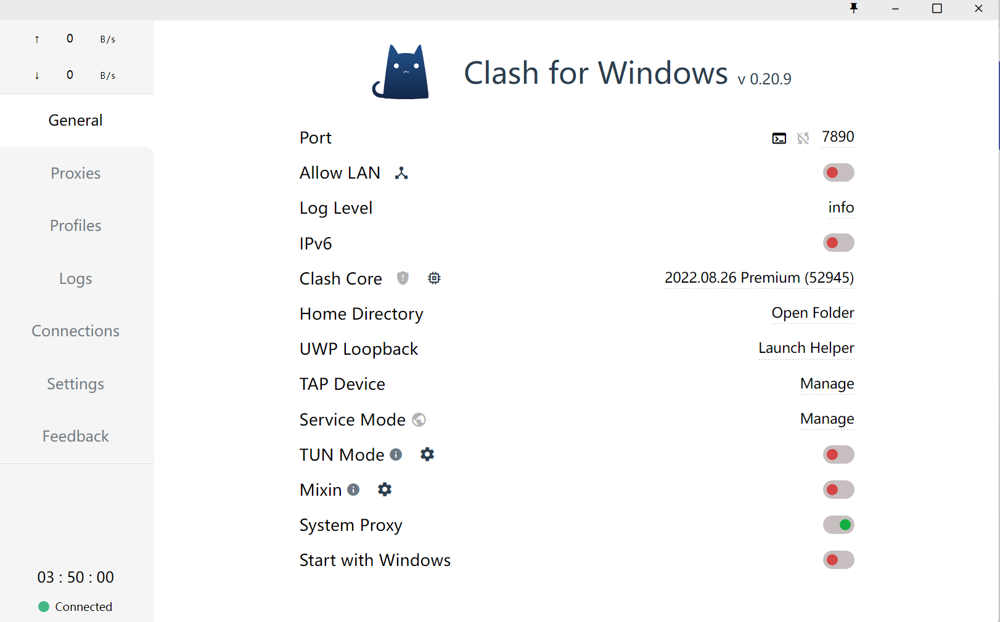
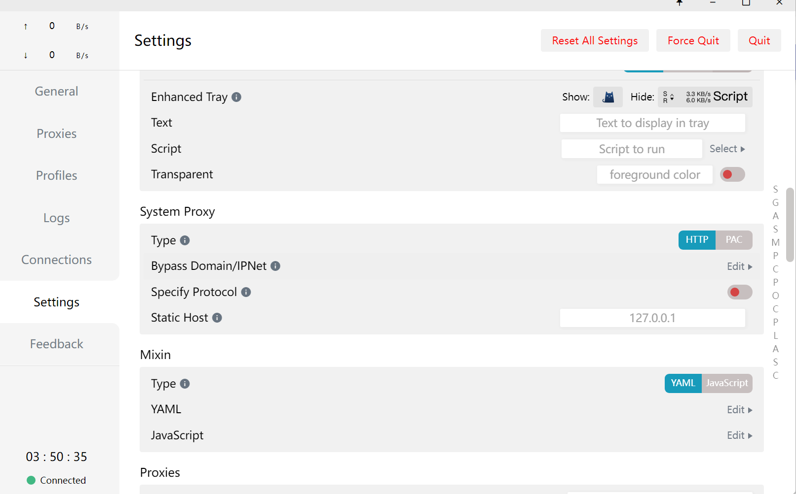

#加速上传git的小技巧
当我们开代理后，虽然我们能够流畅地访问google之类的网站了，但在上传git的时候，有时还是会出现一些问题。

这个时候就需要我们手动配置git的代理了！

配置代码如下：
```
// 这里涉及两个参数‘192.168.0.1’和‘1080’
git config --global http.proxy 'http://192.168.0.1:1080'
git config --global https.proxy 'http://192.168.0.1:1080'
```

如何获取上面的两个参数？
以Clash for windows为例


上面的Port就是‘1080’, static host就是‘192.168.0.1’。

根据自己电脑的代理情况，修改这两个参数后运行命令即可。
